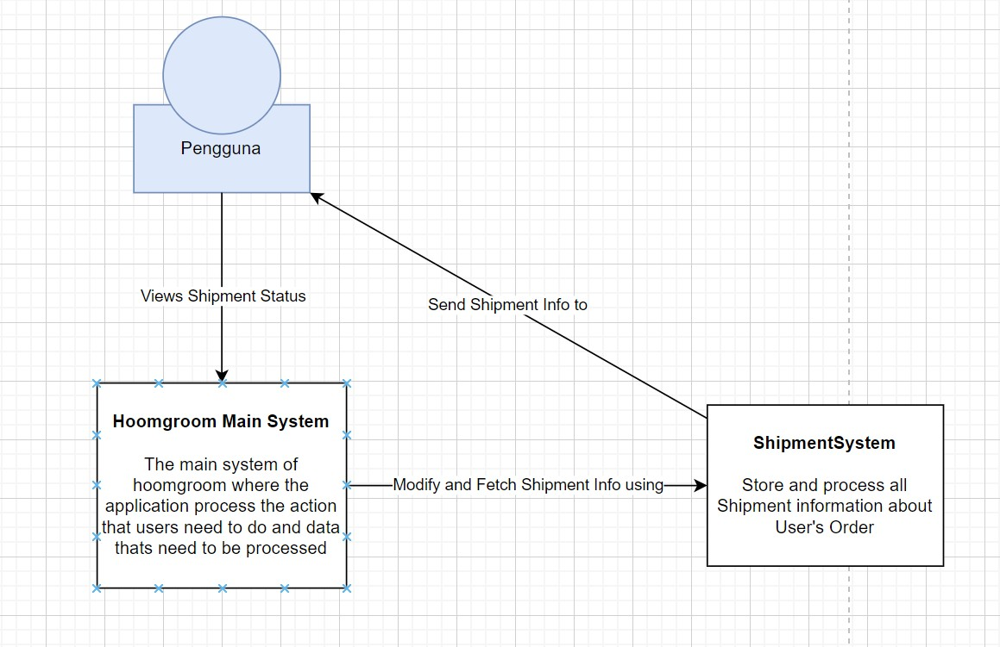
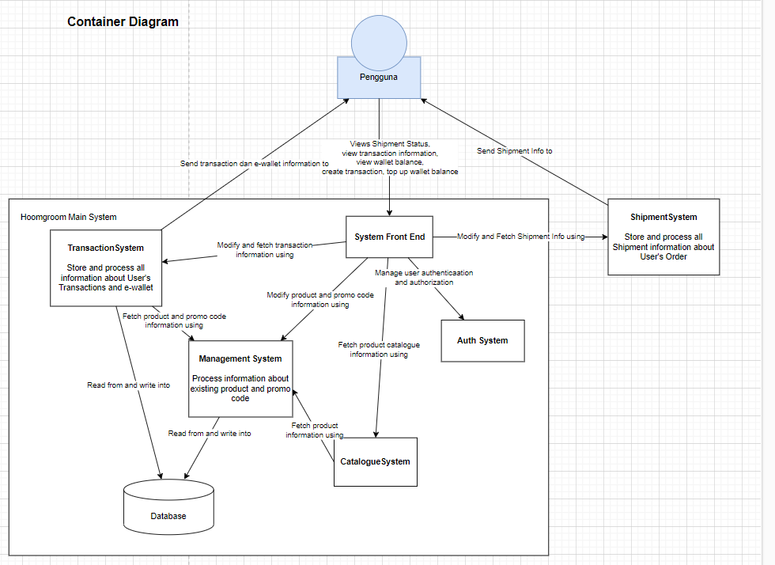
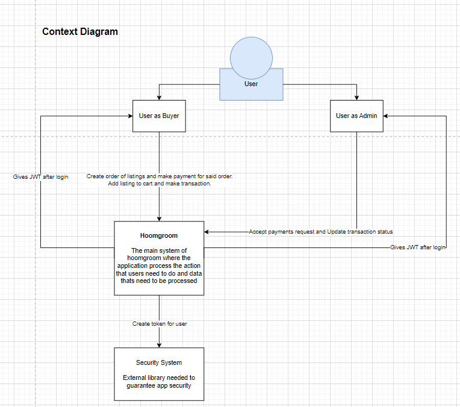
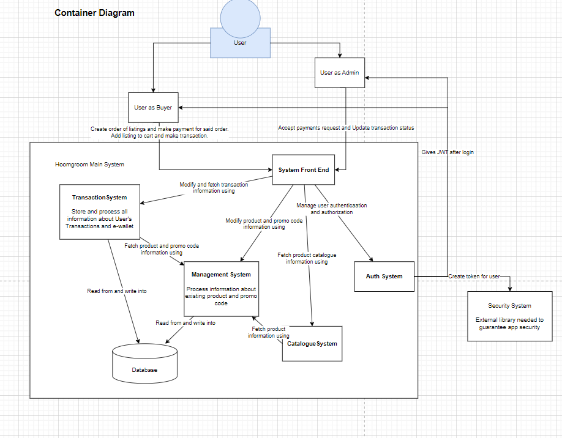

----------------------------------------------------------------------------------------------------------
Tutorial 12 reflection:
1. initial diagram:
context:

container:


2. future diagram
context:

container:


3. Risk storming:

1. Pengubahan keamanan dengan menggunakan library third party untuk memastikan keamanan aplikasi tetap terjaga
2. pengubahan role pengguna menjadi admin dan user biasa dimana admin dapat mendaftarkan barang baru dikarenakan kekhawatiran bahwa pengguna biasa yang dapat menambahkan produk secara bebas dapat melakukan penipuan dengan mudah jika tidak diverifikasi terlebih dahulu. hal ini juga meningkatkan keamanan aplikasi.
3. Aslinya penggunaan 1 database untuk semua microservice menurut kami terlalu beresiko, namun karena penggunaan lebih banyak database dapat meningkatkan biaya operasional. Selain itu, jika tiap microservice bekerja menggunakan database yang berbeda, jika database untuk suatu microservice gagal, kami khawatirkan hal tersebut tetap akan membuat microservice lain juga tidak berfungsi karena tiap microservice pada aplikasi kami sering berkomunikasi. Oleh karena beberapa alasan tersebut, kami memutuskan untuk tetap menggunakan 1 database.

----------------------------------------------------------------------------------------------------------
This is a [Next.js](https://nextjs.org/) project bootstrapped with [`create-next-app`](https://github.com/vercel/next.js/tree/canary/packages/create-next-app).

## Getting Started

First, run the development server:

```bash
npm run dev
# or
yarn dev
# or
pnpm dev
# or
bun dev
```

Open [http://localhost:3000](http://localhost:3000) with your browser to see the result.

You can start editing the page by modifying `app/page.tsx`. The page auto-updates as you edit the file.

This project uses [`next/font`](https://nextjs.org/docs/basic-features/font-optimization) to automatically optimize and load Inter, a custom Google Font.

## Learn More

To learn more about Next.js, take a look at the following resources:

- [Next.js Documentation](https://nextjs.org/docs) - learn about Next.js features and API.
- [Learn Next.js](https://nextjs.org/learn) - an interactive Next.js tutorial.

You can check out [the Next.js GitHub repository](https://github.com/vercel/next.js/) - your feedback and contributions are welcome!

## Deploy on Vercel

The easiest way to deploy your Next.js app is to use the [Vercel Platform](https://vercel.com/new?utm_medium=default-template&filter=next.js&utm_source=create-next-app&utm_campaign=create-next-app-readme) from the creators of Next.js.

Check out our [Next.js deployment documentation](https://nextjs.org/docs/deployment) for more details.
